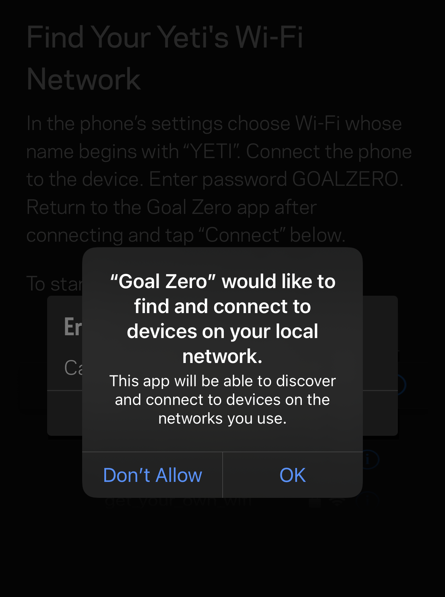

# Goal Zero Yeti App

### 5/13/2021 – iOS 14 "Allow Local Network"

In iOS 14, Apple [introduced a security feature](https://support.apple.com/en-us/HT211870) to let users know when an app is trying to access other devices on the network. Goal Zero Yeti App needs to be allowed local network traffic in order to find your Yeti over Wifi and to be able to send the necessary requests to the Goal Zero Yeti App Cloud. If you see the following prompt, be sure to select "OK".

### abc1

In iOS 14, Apple [introduced a security feature](https://support.apple.com/en-us/HT211870) to let users know when an app is trying to access other devices on the network. Goal Zero Yeti App needs to be allowed local network traffic in order to find your Yeti over Wifi and to be able to send the necessary requests to the Goal Zero Yeti App Cloud. If you see the following prompt, be sure to select "OK".

### abc2

In iOS 14, Apple [introduced a security feature](https://support.apple.com/en-us/HT211870) to let users know when an app is trying to access other devices on the network. Goal Zero Yeti App needs to be allowed local network traffic in order to find your Yeti over Wifi and to be able to send the necessary requests to the Goal Zero Yeti App Cloud. If you see the following prompt, be sure to select "OK".

### abc3

In iOS 14, Apple [introduced a security feature](https://support.apple.com/en-us/HT211870) to let users know when an app is trying to access other devices on the network. Goal Zero Yeti App needs to be allowed local network traffic in order to find your Yeti over Wifi and to be able to send the necessary requests to the Goal Zero Yeti App Cloud. If you see the following prompt, be sure to select "OK".

### abc4

In iOS 14, Apple [introduced a security feature](https://support.apple.com/en-us/HT211870) to let users know when an app is trying to access other devices on the network. Goal Zero Yeti App needs to be allowed local network traffic in order to find your Yeti over Wifi and to be able to send the necessary requests to the Goal Zero Yeti App Cloud. If you see the following prompt, be sure to select "OK".

### abc5

In iOS 14, Apple [introduced a security feature](https://support.apple.com/en-us/HT211870) to let users know when an app is trying to access other devices on the network. Goal Zero Yeti App needs to be allowed local network traffic in order to find your Yeti over Wifi and to be able to send the necessary requests to the Goal Zero Yeti App Cloud. If you see the following prompt, be sure to select "OK".